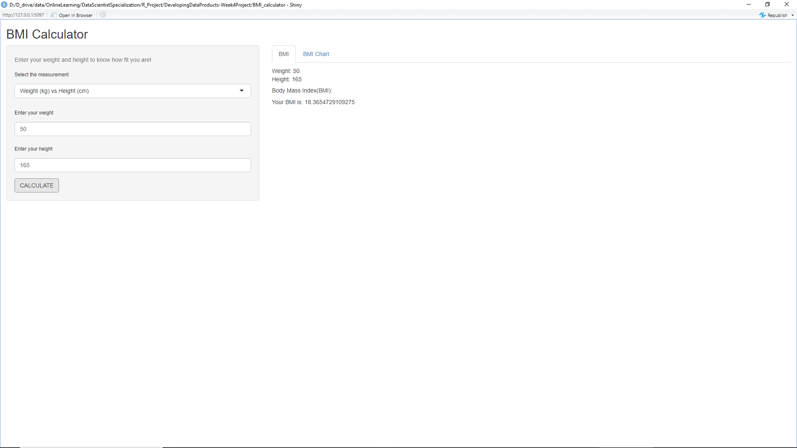

Developing Data Products: Week 4 Assignment
========================================================


Introduction
========================================================
This document is part of the Week 4 assignment for the course of Developing Data Products jointly organized by Coursera and Johns Hopkins University. The project is to develop an App which is an online calculator for Body Mass Index (BMI) - a measure of body fat based on height & weight of adult men and women. It consists of two parts:

1. Create a Shiny application and deploy it on Rstudio's servers - Shiny website.

2. Use Rstudio Presenter to prepare a reproducible pitch presentation about the application. The presentation is available in RPub.

All files are stored at Github Repository. Please see the Appendix for links to the files.


Application Overview
========================================================
* The application is written in Shiny which is a web application framework for R

* The source code consists of two files: server.R and ui.R

* server.R includes the the server logic of a Shiny web application

* ui.R includes the the user-interface definition, which uses the sidebarLayout template

* The coding for server.R and ui.R code are shared on github

* The application is hosted on cloud supported by Rstudio's shiny server (Shinyapps.io)

Application Panels of BMI Calculator

* SIDE PANEL: It provides Input parameters for weight, height and type of measurement.

* MAIN PANEL: It contains 2 tabs, one for displaying the calculated BMI and another one for the BMI Chart that users could refer to see if theri body weuight is appropriate with respect to their body height.


Application Widgets of BMI Calculator
========================================================
* widget of selectInput for measurement: A box with 2 choices to select from, namely “Weight (kg) vs Height (cm)” and “Weight (lb) vs Height (inches)”

* widget of numericInput for weight: A field to enter weight

* widget of numericInput for height: A field to enter height

* widget of actionButton for calculation: An Action Button to calculate


How can we use the BMI Calculator App?
========================================================
1. Select the measurement type.

2. Enter your body weight and height.

3. Click the CALCULATE button.

Once the CALCULATE button is clicked, the BMI will be displayed on the Main Panel. The BMI Chart tab can be used for reference to see the status whether you are normal, overweight or underweight.

User Interface of BMI Calculator App
========================================================


server.R
========================================================
```r
library(shiny)
library(htmlwidgets)

shinyServer(function(input, output) {
    
    values <- reactiveValues()
    
    # Calculating the BMI
    observe({
        input$action_Calc
        if(input$select_measure==1){
            values$bmi <- isolate({
                input$num_weight / ((input$num_height/100) *(input$num_height/100))
            })
        }
        else{
            values$bmi <- isolate({
                input$num_weight / (input$num_height *input$num_height)*703
            })
        }
    })
    
    # Display the input values (weight & height) and output value (BMI)
    output$text_weight <- renderText({
        input$action_Calc
        paste("Weight: ", isolate(input$num_weight))
    })
    
    output$text_height <- renderText({
        input$action_Calc
        paste("Height: ", isolate(input$num_height))
    })
    
    output$text_bmi <- renderText({
        if(input$action_Calc == 0) ""
        else 
            paste("Your BMI is:", values$bmi)
    })
    
})
```


ui.R
========================================================
```r
library(shiny)

# Define UI for application of BMI calculator 
shinyUI(fluidPage(
    
    # Application title
    titlePanel("BMI Calculator"),
    
    # Sidebar with a slider input for number of bins 
    sidebarLayout(
        sidebarPanel(
            helpText("Enter your weight and height to know how fit you are!"),  
            selectInput("select_measure", label = h6("Select the measurement"), choices = list("Weight (kg) vs Height (cm)" = 1, "Weight (lb) vs. Height (inches)" = 703), selected = 1),
            numericInput("num_weight", label = h6("Enter your weight"), min = 1, value = NULL),
            numericInput("num_height", label = h6("Enter your height"), min = 1, value = NULL),
            actionButton("action_Calc", label = "CALCULATE")
        ),
        mainPanel(
            tabsetPanel(
                tabPanel("BMI",
                         p(h5("")), textOutput("text_weight"),
                         textOutput("text_height"), p(h5("Body Mass Index(BMI):")),
                         textOutput("text_bmi")
                ),
                tabPanel("BMI Chart",
                         p(h4("BMI Calculator:")),
                         helpText("Statistical Categories of BMI as given by the National Heart, Lung, and Blood Institute (NLBI)"),
                         HTML(
                         "<br> </br>
                         <b> less than 18.5 </b> = underweight <br>
                         <br> </br>
                         <b> Between 18.5 and 24.9 </b> = Normal weight <br>
                         <br> </br>
                         <b> Between 25 and 29.9 </b> = Overweight <br>
                         <br> </br>
                         <b> greater than 30 </b> = Obsesity <br>"
                         )
                )
            )
        )
    )
))
```


Appendix and Links
========================================================

- App hosted on Shiny website:
 https://kenyang.shinyapps.io/bmi_calculator/

- Source Code stored in Github:
https://github.com/kenyang88/DevelopingDataProducts-Week4Project

- Presentation available at RPubs:
https://rpubs.com/kenyang/780152
